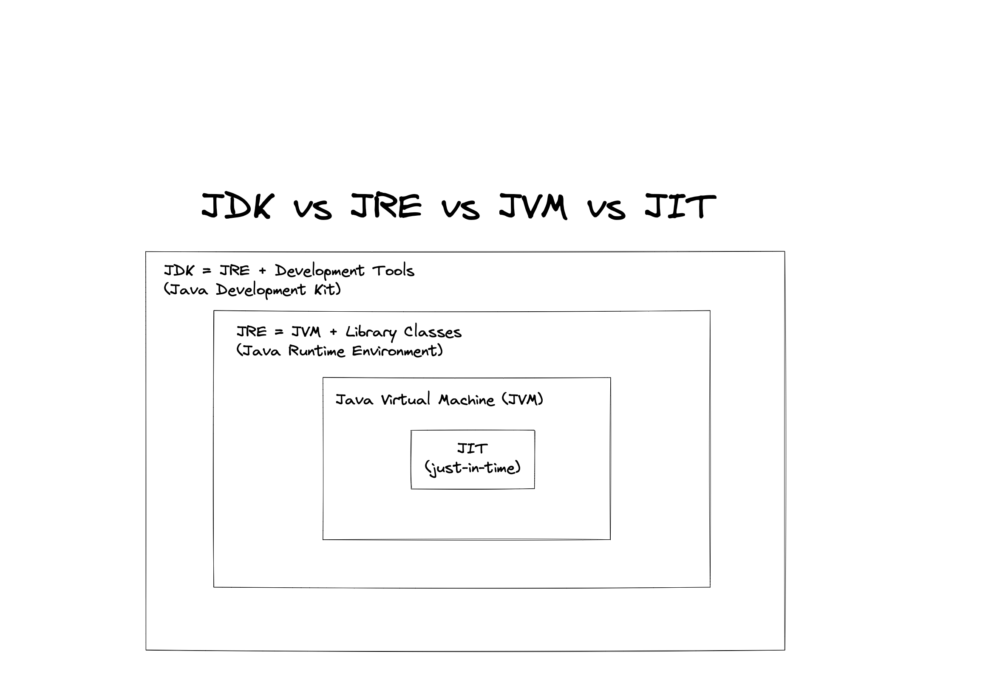

  <h1>How Java works</h1>

  <h3 color="blue" align="center">How code execute</h3>
  
  

    <ul>
      <li>First we write code so humans can understand it.</li>
      <li>
        Compiler converts the Java file (entire file) into `.class` file, which
        we also call `byte code`.
        <ul>
          <li>You cant directly run this byte code</li>
          <li>
            we need JVM (java virtual machine) to convert this peice of code
            into machine code
          </li>
        </ul>
      </li>
      <li>Interpreter will conver code line by line</li>
      <li>
        Byte code can run on any OS, why ?... coz it is ***not*** directly getting
        converted in machine code through compiler. This byte code can run on any OS
      </li>
      <li> JVM is plaform dependent </li>
  </ul>

  

 

 
 
 

  <h3 color="blue" align="center">JDK ( JAVA development kit )</h3>
  
  <ul>
    <li>Its a env package which you need, to run the java program  
<ul>
    <li> development tools </li>
    <li> JRE- to execute your program </li>
    <li> compiler- javac </li>
    <li> archiver- jar </li>
    <li> docs generator- javadoc </li>
    <li> interpreter/loader </li>
 </ul>
    <li> You can download this JDK from here:- <a href="https://www.oracle.com/java/technolog"> go here to download </a>  </li>
    </li>
   </ul>

 
 

 
 
 

  <h3  align="center">JVM execution</h3>
  <ul>
    <li> we get Interpreter in JVM
<ul>
    <li> Interpreter executes code line by line to convert it in machine code </li>
    <li> Suppose we have one method/function called multiple times it will inetrepret that peice of code again and again  </li>
    so to prevent that we hava `JIT`
    <li>Just in Time compiler:- it checks if the code is called again and again it will not interpret the previous code again</li>
    <li> JIT will provide the machine code which alredy converted in MC</li>
    </li>
   </ul>

 
 
 

Working
 

-------| -> Java source code

            | -> Goes into JDK

            | -> it gets compiled

            | -> By javaC compiler

                | -> Compiles it into `.class` file
                | -> which contains `Byte code`
                    | -> This code get to JVM
                    | -> JVM converts the code into machine code
                    | -> with interpreter
                        | -> this code goes in JRE
                        | -> we get output

> End moment Notes

- `JRE` is nothing but `JVM` + some extra files
- when ever `JVM` need some libarary or files it asks all that to `JRE`

 
 
 

 
 
